# BeneChain

BeneChain is a fully on-chain corporate benefits platform built on the Internet Computer Protocol (ICP). It empowers companies to create, distribute, and monitor employee benefit programs without intermediaries — using smart contracts (canisters) to ensure full transparency, automation, and auditability.

Traditional corporate benefits systems are plagued by inefficiencies:

* High transaction and processing fees
* Payment delays to merchants
* Lack of control and traceability for HR departments
* Inflexible benefit programs with low portability for employees

BeneChain offers a paradigm shift. By leveraging the unique capabilities of ICP, we’ve created a decentralized platform that connects HR managers, employees, and merchants directly through on-chain logic — with zero reliance on Web2 infrastructure or third-party processors.

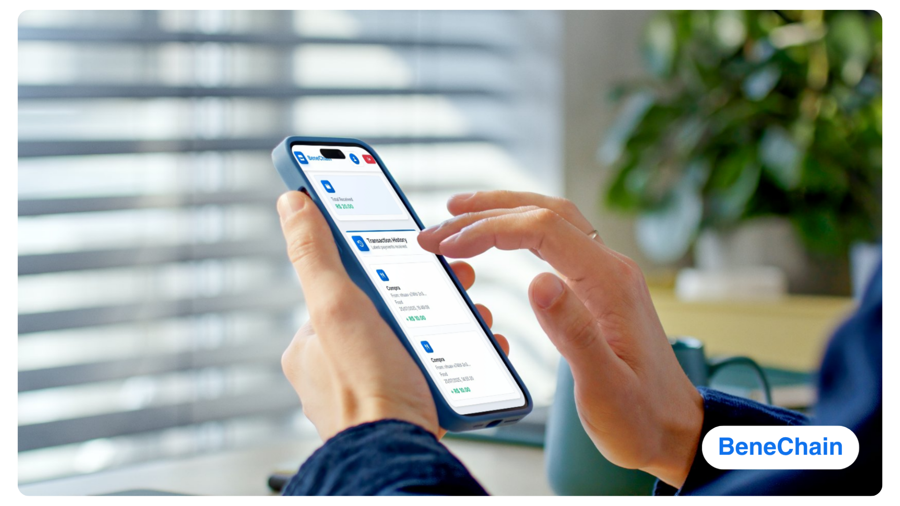

**Business Plan:** [Link](https://github.com/InteliThreeGroup/Beneficios/blob/main/BusinessPlan.md)

**Technical Documentation:** [Link](https://github.com/InteliThreeGroup/Beneficios/blob/main/docs.md)

**Pitch Deck:** [Link](https://github.com/InteliThreeGroup/Beneficios/blob/main/assets/Pitch%20Deck%20BeneChain.pdf)

**Demo Video:** [Link](https://youtu.be/UYSJWSu4KBE)


### Core Value Proposition

* **HR Departments** gain full control over benefit rules, real-time dashboards, and audit trails — reducing fraud and manual work.
* **Workers** receive portable, on-chain wallets linked to their Internet Identity, with real-time balance tracking and zero gas fees.
* **Merchants** are paid instantly with minimal fees, using a self-service dashboard and secure on-chain validation.

BeneChain ensures that benefits are distributed fairly, used according to company-defined rules, and traceable from origin to destination — all within the decentralized runtime of the ICP blockchain.


### Track: **Fully On-Chain**

BeneChain fits perfectly into the Fully On-Chain track of the WCHL 2025 Hackathon. All business logic, data storage, user authentication, and interface hosting are implemented within ICP canisters.

This guarantees:

* Total decentralization
* No need for off-chain APIs, storage, or servers
* Native use of advanced ICP features like:

  * Reverse Gas Model
  * Internet Identity (WebAuthn)
  * HTTPS Outcalls
  * Chain Key Cryptography
  * On-chain Timers


### Social and Economic Impact

By reducing cost and complexity for employers, increasing transparency and control for HR teams, and improving flexibility and purchasing power for workers, BeneChain has the potential to:

* Support financial inclusion of underserved workers
* Improve cash flow and independence for small businesses
* Reduce bureaucracy and dependency on legacy benefit providers
* Contribute to UN Sustainable Development Goals (SDGs) such as decent work, reduced inequalities, and industry innovation

---

## Justification for the “Fully On-Chain” Track

BeneChain was purposefully built to fully align with the “Fully On-Chain” track of the WCHL 2025 Hackathon. All core logic, data storage, permission handling, user identities, and UI hosting are executed entirely inside ICP canisters, without any reliance on off-chain infrastructure. This architectural decision was not only intentional — it was essential to solving the challenges of the corporate benefits industry in a decentralized, scalable way.

### Why This Project Can Only Be Built on ICP

The Internet Computer Protocol offers a unique set of capabilities that no other blockchain provides in a native, seamless environment:

### 1. Canisters as Full-Stack Smart Contracts

* **How we use it**: Every module (HR management, wallet system, merchant validation, reporting, and authentication) is implemented as a dedicated canister (`benefits_manager.mo`, `wallet.mo`, `establishment.mo`, `identity_auth.mo`, and `reporting.rs`).
* **Why ICP**: Unlike EVM-based chains where smart contracts are limited in logic and storage, ICP canisters behave like persistent microservices with native state, HTTP APIs, and near-unlimited logic.

### 2. Reverse Gas Model

* **How we use it**: All transactions (e.g., wallet top-ups, payments, report generation) are paid by the company, not by the workers or merchants.
* **Why ICP**: Only ICP natively supports the reverse gas model, enabling zero-friction UX for non-crypto users — which is critical for adoption in HR environments where users are not crypto-savvy.

### 3. Internet Identity (II)

* **How we use it**: Authentication is handled via Internet Identity, allowing users to log in using secure WebAuthn (e.g., FaceID, fingerprint, security key) without custodial credentials. Each user is mapped to a `Principal`, which is used to define roles and permissions (`#HR`, `#Worker`, `#Establishment`) in `identity_auth.mo`.
* **Why ICP**: Internet Identity ensures both security and user portability across organizations — crucial for workers who switch jobs or companies that manage multiple tenants.

### 4. On-Chain Timers

* **How we use it**: Monthly benefit distributions are automatically scheduled using ICP’s on-chain Timer API. This logic is implemented in `benefits_manager.mo` and ensures that funds are distributed exactly on the configured date, without external triggers or CRON jobs.
* **Why ICP**: Most blockchains lack deterministic native scheduling. ICP’s timers allow trustless, programmable automation inside the canister itself.

### 5. HTTPS Outcalls

* **How we use it** (planned in `reporting.rs` and `establishment.mo`): BeneChain will validate external business identifiers (e.g., CNPJs) and sync data with ERPs using HTTPS requests **directly from smart contracts**.
* **Why ICP**: This is **exclusive to ICP**. No other blockchain can natively perform HTTPS calls from within smart contracts without needing oracles like Chainlink or external bridges.

### In-Code Evidence

* All core logic is stored on-chain, verifiable in the `dfx.json` file and deployed to the ICP mainnet.
* No backend service or database is required — each `Principal` and their associated data are stored and queried directly within canisters.
* The frontend is served from an `asset canister`, fully hosted on-chain via `icx-asset`, eliminating the need for any off-chain frontend deployment (e.g., IPFS, Vercel).
* Inter-canister calls enforce **role-based permissions** via the `identity_auth.mo` service, instead of relying on off-chain middleware or APIs.

### Conclusion

The “Fully On-Chain” nature of BeneChain is not a design preference, it is a technical necessity. Without the features provided by ICP, this platform would require complex off-chain orchestration, gas fee management, and third-party integrations. Instead, thanks to the ICP stack, BeneChain achieves:

* End-to-end decentralization
* Seamless UX for all user roles
* Deterministic automation
* Transparent governance and traceability

BeneChain doesn’t just run on the Internet Computer — it embodies the core vision of what a fully on-chain dApp should be.


---

## System Architecture
BeneChain is architected as a modular, decentralized system built entirely on the Internet Computer Protocol (ICP). Each component is deployed as a smart contract (canister), following a microservices pattern and full separation of concerns. The frontend is also hosted in an **asset canister**, ensuring 100% on-chain execution — no reliance on Web2 infrastructure.

## 1. High-Level System Overview – Full Architecture

This diagram presents the complete application architecture of **BeneChain**, from the user interface to on-chain execution inside the Internet Computer Protocol.

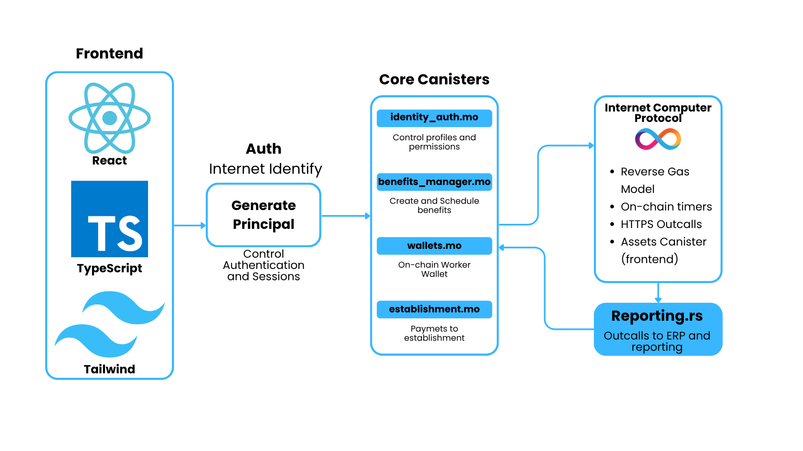

####  Layer-by-Layer Breakdown

#### Frontend (Client-Side)

Built using:

* **React**: Component-based UI
* **TypeScript**: Type safety across the application
* **TailwindCSS**: Fast and responsive styling

Deployed on an **ICP asset canister** via `icx-asset`, ensuring that the entire UI runs on-chain and requires no Web2 infrastructure.

#### Authentication (Internet Identity)

* **Internet Identity** (WebAuthn) allows users to log in using biometrics or hardware keys, without needing wallets or passwords.
* Upon login, each user receives a unique `Principal`, which is used as a persistent on-chain identifier and authorization handle.
* This `Principal` is then passed to canisters to define and enforce access control (e.g., HR, Worker, Merchant roles).

#### Core Canisters (Smart Contracts)

1. **`identity_auth.mo`**
   Handles registration, profile management, role assignment, and access control for each user (`#HR`, `#Worker`, `#Establishment`).

2. **`benefits_manager.mo`**
   Allows HR to create and manage benefit programs, including scheduled distributions using on-chain timers.

3. **`wallets.mo`**
   Stores each worker's on-chain balances per benefit type. Handles credit/debit operations and transaction logs.

4. **`establishment.mo`**
   Allows merchants to register, receive payments from worker wallets, and view transaction history.

5. **`reporting.rs`** *(Planned)*
   Built in Rust for performance and outcall support, this canister will generate detailed usage reports and connect to external ERPs using HTTPS outcalls.


#### Internet Computer Features Used

This infrastructure layer enables BeneChain’s unique advantages:

* **Reverse Gas Model**: Workers and merchants do not pay transaction fees. HR sponsors cycles.
* **On-Chain Timers**: Used for monthly/weekly automatic benefit distributions.
* **HTTPS Outcalls**: Future integrations with ERPs and CNPJ validation services.
* **Asset Canister**: Enables a decentralized frontend UI with no dependency on IPFS or third-party hosts.


#### Architectural Strengths

| Property              | Benefit                                                        |
| --------------------- | -------------------------------------------------------------- |
| **Fully On-Chain**    | No off-chain APIs or storage; full ICP-native stack            |
| **Secure by Design**  | Access control enforced via `Principal` and Internet Identity  |
| **Modular Canisters** | Clear separation of logic by user role and function            |
| **User-Friendly UX**  | Login with WebAuthn; no wallet or gas required for interaction |
| **Auditable**         | Transaction logs and actions persist on-chain for traceability |

## 2. Interaction Flow – From Browser to Canisters

This diagram showcases the full interaction pipeline from end users to the decentralized backend of BeneChain, emphasizing the simplicity and Web2-like UX, built entirely on top of the Internet Computer (ICP).

.png)

### Flow Description

#### User Entry Points

* **HR Departments**, **Workers**, and **Merchants** all access the application through a standard web browser (Chrome, Edge, Firefox).
* No extensions, wallet installations, or onboarding friction are required.

#### Web Frontend

The frontend is built using:

* **React** – Component-driven user interface
* **TypeScript** – Strongly typed logic and integration with ICP declarations
* **TailwindCSS** – Lightweight and responsive styling system
* **Internet Identity** – Used for passwordless authentication via WebAuthn (fingerprint, facial recognition, security keys)

After login, each user receives a unique **Principal**, used as an on-chain identity for all transactions and permission checks.

#### Backend (ICP Canisters)

Once authenticated, all user actions are routed to decentralized smart contracts:

| Canister              | Purpose                                              |
| --------------------- | ---------------------------------------------------- |
| `identity_auth.mo`    | Role registration and permission mapping             |
| `benefits_manager.mo` | Benefit program creation, assignment, and automation |
| `wallets.mo`          | Balance management and transaction logs              |
| `establishment.mo`    | Merchant registration and payment flow               |
| `reporting.mo`        | Analytics, reporting and ERP integrations (planned)  |

All logic, state, and frontend are hosted **natively on ICP**, ensuring high availability, auditability, and zero off-chain dependencies.

### Key Highlights

* **No wallets or gas fees** for users — experience is frictionless
* **Full decentralization** from login to logic
* **ICP-native** architecture using Principal-based permissioning
* Ensures **Web2-level usability** with **Web3-level trust and transparency**


## 3. Sequence Diagram – Dynamic Execution Flow  
This diagram illustrates the dynamic flow of method calls between user actors (HR, Worker, Merchant) and the canisters that orchestrate identity, benefits, wallets, and payment operations in BeneChain.


#### Step-by-Step Breakdown:

1. **HRManager → `identity_auth.createProfile()`**
   Registers the HR manager with a company ID, role `#HR`, and unique `Principal`.

2. **Worker → `identity_auth.createProfile()`**
   Registers the employee under the same or another company, role `#Worker`.

3. **Merchant → `identity_auth.createProfile()`**
   Registers a merchant account with role `#Establishment`.

4. **HRManager → `benefits_manager.createBenefitProgram()`**
   Creates a benefit program by providing the company ID, frequency (e.g., monthly), and the benefit type (`#Food`, `#Culture`, etc.).

5. **`benefits_manager` → `identity_auth.hasRole(#HR)` + `belongsToCompany()`**
   Verifies that the caller is an authorized HR manager from the specified company.

6. **HRManager → `benefits_manager.assignWorkerToBenefit()`**
   Associates the worker (by `Principal`) to the created benefit program.

7. **`benefits_manager` → `wallets.createWallet(worker)`**
   Initializes a wallet canister entry for the worker if it does not exist.

8. **(Automated) `benefits_manager.executePayment()`**
   Periodic execution triggered by **on-chain timers**, based on the benefit frequency.

9. **`benefits_manager` → `wallets.creditBalance()`**
   Credits the correct benefit amount to each eligible worker’s wallet.

10. **Merchant → `establishment.processPayment()`**
    Initiates a payment request when the worker scans and authorizes a transaction.

11. **`establishment` → `identity_auth.hasRole(establishment)`**
    Verifies that the merchant has the appropriate permissions.

12. **`establishment` → `wallets.debitBalance()`**
    Debits the amount from the worker’s wallet for the benefit type being used.

13. **`wallets` → `establishment.confirmPayment()`**
    Confirms the success or failure of the payment to the merchant.


### Observations:

* All inter-canister communication is asynchronous and permission-checked.
* Worker and merchant interactions are gasless, enabled by the Reverse Gas Model.
* All actions are auditable via `getTransactionHistory()` in the `wallets` and `establishment` canisters.
* The flow is triggered both by user actions and scheduled automation via ICP Timers.

## 4. User Flow Diagram – Experience Across Roles

This diagram outlines the high-level user experience for each main role in BeneChain. It showcases the simplicity of the onboarding and operational flow, leveraging Internet Identity and a streamlined UI for each user type.

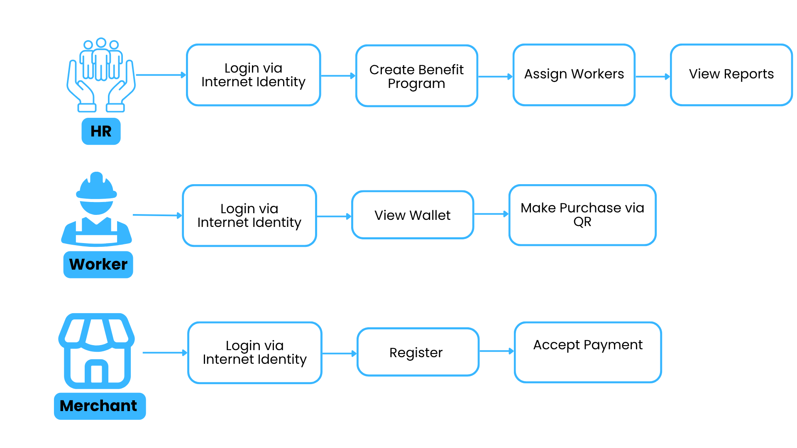


#### HR (Human Resources)

* **Login via Internet Identity**: No seed phrase or extension required. Identity is verified through WebAuthn.
* **Create Benefit Program**: Define type (e.g. #Food, #Culture), value, and frequency (e.g. monthly).
* **Assign Workers**: Add or remove participants from benefit programs.
* **View Reports**: Monitor usage, view transaction logs, and detect anomalies via on-chain queries.


#### Worker (Employee)

* **Login via Internet Identity**: Single identity across jobs, portable between employers.
* **View Wallet**: Displays categorized token balances (e.g. Food, Health).
* **Make Purchase via QR**: Interact with merchants directly using a QR code linked to their benefit wallet.


#### Merchant (Establishment)

* **Login via Internet Identity**: Onboards seamlessly, no need to manage private keys or wallets.
* **Register**: Provides business ID (e.g. CNAE) and defines accepted benefit types.
* **Accept Payment**: Authorizes and confirms transactions directly from worker wallets.

### Highlights

* Fully **gasless experience**: all costs sponsored by HR, enabling frictionless adoption.
* **No crypto knowledge required** for any role.
* **Single flow** for each persona, mapped to clear UI screens and canister calls.
* Designed for mobile-first usability with React + Tailwind.

Ótimo! Esse diagrama representa uma **visão UML de canisters**, detalhando os dados internos e as funções públicas de cada contrato inteligente do projeto **BeneChain**.


## 5. Canister Responsibilities and Interfaces (UML View)

This diagram provides a static overview of all the main canisters (smart contracts) in the BeneChain system. Each canister encapsulates its own state and exposes a limited, well-defined public interface. This modular architecture enforces clear separation of concerns and enhances scalability and security.

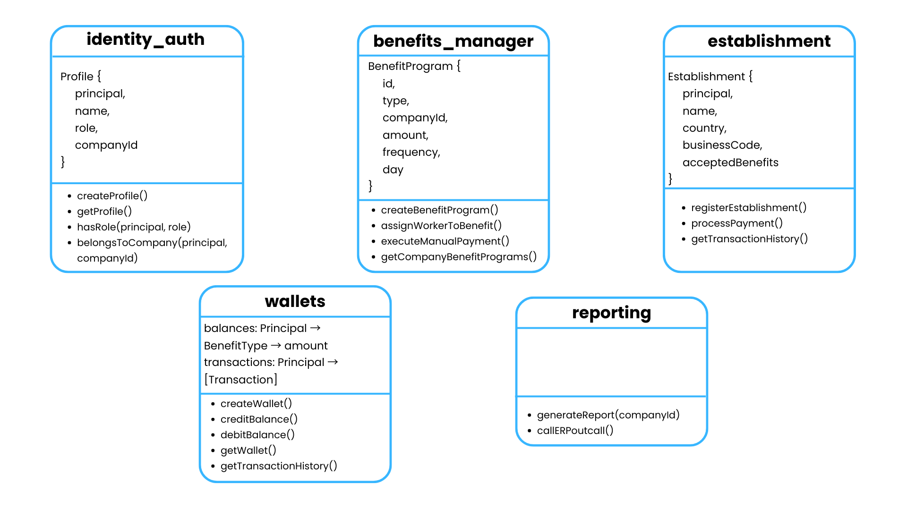


### `identity_auth.mo`

**Purpose**: Manage user profiles and role-based access control.

**Data model:**

```motoko
Profile {
  principal: Principal,
  name: Text,
  role: Role,         // #HR | #Worker | #Establishment
  companyId: ?Text
}
```

**Public Functions:**

* `createProfile()`: Registers the caller with their name, role, and company.
* `getProfile()`: Returns the profile of the authenticated caller.
* `hasRole(principal, role)`: Checks if a principal has a specific role.
* `belongsToCompany(principal, companyId)`: Validates company affiliation.

###  `benefits_manager.mo`

**Purpose**: Handle creation, configuration, assignment, and distribution of benefit programs.

**Data model:**

```motoko
BenefitProgram {
  id: Text,
  type: BenefitType,     // #Food, #Culture, etc.
  companyId: Text,
  amount: Nat,
  frequency: Frequency,  // #Monthly, #Weekly, etc.
  day: Nat
}
```

**Public Functions:**

* `createBenefitProgram()`: Defines a new benefit rule for a company.
* `assignWorkerToBenefit()`: Associates a worker to a benefit program.
* `executeManualPayment()`: Triggers a distribution manually (also run via Timer).
* `getCompanyBenefitPrograms()`: Lists all programs linked to a company.


### `establishment.mo`

**Purpose**: Manage merchant registration and process payments from workers.

**Data model:**

```motoko
Establishment {
  principal: Principal,
  name: Text,
  country: Text,
  businessCode: Text,
  acceptedBenefits: [BenefitType]
}
```

**Public Functions:**

* `registerEstablishment()`: Registers a merchant and defines accepted benefit types.
* `processPayment()`: Validates and executes payments from workers.
* `getTransactionHistory()`: Returns the merchant’s payment history.


### `wallets.mo`

**Purpose**: Serve as the worker's on-chain wallet with multiple benefit balances.

**Data model:**

```motoko
balances: Principal -> BenefitType -> Nat
transactions: Principal -> [Transaction]
```

**Public Functions:**

* `createWallet()`: Initializes a new wallet for a worker.
* `creditBalance()`: Adds tokens for a specific benefit.
* `debitBalance()`: Removes tokens upon merchant payment.
* `getWallet()`: Returns all current balances by benefit type.
* `getTransactionHistory()`: Retrieves past operations for auditing.


### `reporting.rs`

**Purpose** *(Planned)*: Aggregate and export system-level analytics and metrics.

**Public Functions:**

* `generateReport(companyId)`: Produces a report with benefit usage per company.
* `callERPoutcall()`: Initiates a secure HTTP request to external ERP systems (via HTTPS Outcalls).

---

## 6. Canister Responsibilities Table

The table below summarizes the responsibilities, access scope, and language implementation of each core smart contract (canister) in the BeneChain system.

| Canister              | Description                                                           | Language | Accessed by                            | Key Methods                                                                   |
| --------------------- | --------------------------------------------------------------------- | -------- | -------------------------------------- | ----------------------------------------------------------------------------- |
| `identity_auth.mo`    | Manages user identity, role-based access control, and company linkage | Motoko   | All canisters, users                   | `createProfile()`, `hasRole()`, `belongsToCompany()`                          |
| `benefits_manager.mo` | Creates, schedules, and distributes benefit programs                  | Motoko   | HR, Timer, Wallets                     | `createBenefitProgram()`, `assignWorkerToBenefit()`, `executeManualPayment()` |
| `wallets.mo`          | Stores balances and transaction logs per worker and benefit type      | Motoko   | BenefitsManager, Establishment, Worker | `creditBalance()`, `debitBalance()`, `getWallet()`                            |
| `establishment.mo`    | Registers merchants, processes payments from workers                  | Motoko   | Merchants, Wallets                     | `registerEstablishment()`, `processPayment()`                                 |
| `reporting.rs`        | (Planned) Aggregates usage metrics, performs outcalls to ERPs         | Rust     | Internal/Analytics                     | `generateReport()`, `callERPoutcall()`                                        |
| `BENEFICIOS_frontend` | Serves the entire web UI as an asset canister                         | Asset    | End users (browser)                    | Static file hosting via `icx-asset`                                           |


### Observations

* Each canister follows **Single Responsibility Principle**.
* Canisters communicate asynchronously using **typed actor interfaces**.
* All user-facing actions map directly to one or more canister methods.


## 7. Identity & Permissioning

BeneChain leverages the Internet Computer's native authentication system, **Internet Identity (II)**, to ensure secure, passwordless login and robust on-chain access control. Every authenticated user is assigned a **unique Principal** (identity key), which is stored and validated directly within the smart contract layer.

#### Identity Flow

1. **User logs in** via WebAuthn using Internet Identity (e.g. biometrics, security key, or browser credentials).
2. **II returns a `Principal`** — a globally unique, pseudonymous identifier.
3. The user’s Principal is stored and managed in the `identity_auth.mo` canister.
4. Role-based access (HR, Worker, Establishment) is enforced via internal checks on each call.

#### Data Model (`identity_auth.mo`)

```motoko
type Role = { #HR; #Worker; #Establishment };

type Profile = {
  principal: Principal;
  name: Text;
  role: Role;
  companyId: ?Text;
};
```

Each user has a profile stored on-chain that includes:

* Their unique Principal (returned from Internet Identity)
* A display name
* Their role (used for access control)
* An optional company affiliation

#### Access Control Logic

All sensitive functions in other canisters (e.g. `assignWorkerToBenefit`, `processPayment`, `creditBalance`) **first validate**:

1. That the caller has a valid profile
2. That the caller has the appropriate role for that action
3. That they belong to the same company if required (e.g. HR and Worker linkage)

Example validation flow in `benefits_manager.mo`:

```motoko
if (await IdentityAuth.hasRole(callerPrincipal, #HR) and
    await IdentityAuth.belongsToCompany(callerPrincipal, program.companyId)) {
  // Proceed with action
} else {
  // Reject unauthorized request
}
```

### Highlights

| Feature                              | Description                                             |
| ------------------------------------ | ------------------------------------------------------- |
| **Passwordless login**               | Powered by Internet Identity and WebAuthn               |
| **Per-user profile mapping**         | Stored in `identity_auth.mo`                            |
| **On-chain role validation**         | Used in all permissioned canisters                      |
| **Company-scoped access control**    | Ensures multi-tenant safety and data isolation          |
| **No custodial auth infrastructure** | Everything runs within ICP — no third-party auth needed |

---

## 8. Data Storage Strategy

All application state in BeneChain is stored **entirely on-chain**, inside each canister’s memory. The Internet Computer allows for **upgrade-safe persistence** through `stable` variables and data structures, ensuring no data is lost across deployments.

#### Upgrade-Safe Persistence

Each core canister declares its state using `stable var` or `stable`-wrapped collections like `TrieMap`, `Array`, or custom records. This enables:

* Durable data between upgrades
* Version-safe evolution of models
* Full decentralization (no off-chain DBs)

#### Wallet Balances (`wallets.mo`)

Worker balances are stored as a nested mapping:

```motoko
stable var balances: TrieMap<Principal, TrieMap<BenefitType, Nat>> = ...;
```

* The outer map links a user’s `Principal` to their personal wallet
* The inner map contains amounts for each benefit type (e.g., Food, Transport)
* Negative balances are explicitly rejected in logic

#### Transaction History

Each credit or debit generates a new transaction object, stored immutably in:

```motoko
stable var transactions: TrieMap<Principal, [Transaction]> = ...;

type Transaction = {
  timestamp: Time;
  benefit: BenefitType;
  amount: Nat;
  direction: { #credit; #debit };
  description: Text;
};
```

* Accessible to the user via `getTransactionHistory()`
* Ensures auditability and full traceability for each worker

#### Multi-Tenant Isolation

To support multiple companies on a single deployment:

* HR and Worker relationships are tied to `companyId`
* Benefit programs (`benefits_manager.mo`) are grouped by `companyId`
* Establishments can optionally register under a company or act independently

#### Other Canisters

| Canister              | Data Model                                               |
| --------------------- | -------------------------------------------------------- |
| `identity_auth.mo`    | Maps `Principal → Profile { name, role, companyId }`     |
| `benefits_manager.mo` | Stores programs by ID, company, frequency, and value     |
| `establishment.mo`    | Maps `Principal → Establishment { name, types, status }` |
| `reporting.rs`        | (Planned) Will store cached reports and ERP sync results |


### Highlights

| Aspect               | Strategy                                                         |
| -------------------- | ---------------------------------------------------------------- |
| On-chain persistence | All data is stored in canisters using stable structures          |
| Upgrade safety       | Compatible with `dfx deploy --upgrade`                           |
| Role-based mapping   | Each `Principal` stores its own wallet, history, and profile     |
| Multi-tenant support | Each entity is scoped by `companyId`                             |
| Fully auditable      | All financial actions are immutably recorded in transaction logs |

---

## 9. Timer Automation Logic

BeneChain uses the **Internet Computer’s native timer API** to automate the execution of recurring benefit distributions without any external triggers or schedulers. This ensures a truly decentralized, self-operating system.

#### Why On-Chain Timers Matter

* No need for cron jobs, bots or backend servers
* Reduces operational complexity and central points of failure
* All automation is **verifiable and auditable** on-chain

#### Implementation

Timers are managed in the `benefits_manager.mo` canister using the `Timer.setTimer()` API.

Each `BenefitProgram` contains a defined frequency and day:

```motoko
type Frequency = { #Monthly; #Weekly; #OneTime };

type BenefitProgram = {
  id: Text;
  type: BenefitType;
  companyId: Text;
  amount: Nat;
  frequency: Frequency;
  day: Nat; // Day of week or month
};
```

When a benefit program is created, the system schedules its first execution based on its frequency:

```motoko
Timer.setTimer(Time.now() + computeDelay(program.frequency, program.day), distribute(program.id));
```

After each execution, the next run is re-scheduled:

```motoko
func distribute(programId: Text): async () {
  // credit all assigned workers
  await creditBalance(programId);

  // reschedule next cycle
  Timer.setTimer(Time.now() + computeNextDelay(...), distribute(programId));
};
```

#### Key Functions

| Function                  | Description                                          |
| ------------------------- | ---------------------------------------------------- |
| `computeDelay()`          | Calculates delay in nanoseconds until next execution |
| `creditBalance()`         | Calls `wallets.mo` to distribute amounts             |
| `setTimer()`              | Schedules the execution of `distribute()`            |
| `assignWorkerToBenefit()` | Keeps an internal mapping of workers per program     |

### Highlights

| Feature                  | Benefit                                                 |
| ------------------------ | ------------------------------------------------------- |
| Fully on-chain scheduler | No backend or off-chain scheduler needed                |
| Resilient & predictable  | All executions logged and tied to exact timestamps      |
| Auditable automation     | Can verify past/future executions in the canister state |
| Scalable                 | Works independently for each benefit program            |

---

### 10. Inter-Canister Communication

BeneChain uses the Internet Computer’s native support for **typed asynchronous inter-canister calls** to coordinate logic between modular services. Each smart contract (canister) exposes a public interface, allowing other canisters to invoke its functions in a secure and verifiable way.

#### Example: Distributing Benefits

The `benefits_manager.mo` canister periodically calls the `wallets.mo` canister to credit the appropriate amount to each worker:

```motoko
let wallet = actor "wallets-canister-id" : actor {
  creditBalance : (CreditRequest) -> async Result;
};

let result = await wallet.creditBalance({
  workerId = worker;
  benefitType = #Food;
  amount = 50000;
});
```

#### Security: Role Validation First

Before any inter-canister call is executed, the system enforces strict role checks using the `identity_auth.mo` canister:

```motoko
if (await identityAuth.hasRole(caller, #HR)) {
  // proceed with operation
}
```

This ensures that only authorized entities (e.g., HR managers, merchants) can trigger cross-canister operations.

#### Error Handling

All asynchronous calls are pattern-matched to capture errors gracefully:

```motoko
switch (await wallet.creditBalance(...)) {
  case (#ok _) { /* success */ };
  case (#err e) { Debug.print("Transfer failed: " # e); };
};
```

#### Canister Interaction Summary

| Caller Canister       | Target Canister | Purpose                     |
| --------------------- | --------------- | --------------------------- |
| `benefits_manager`    | `wallets`       | Credit worker balances      |
| `establishment`       | `wallets`       | Debit balances upon payment |
| `benefits_manager`    | `identity_auth` | Validate HR role & company  |
| `establishment`       | `identity_auth` | Validate merchant role      |
| `reporting` (planned) | All others      | Pull data for reporting     |

### Highlights

| Capability                    | Benefit                                                  |
| ----------------------------- | -------------------------------------------------------- |
| Typed actor interfaces        | Compile-time validation of contract signatures           |
| Asynchronous execution        | Non-blocking, reliable system behavior                   |
| Principal-based access checks | Full identity-aware communication                        |
| Modular responsibility        | Clean separation of logic and easier testing             |
| Secure and auditable flows    | All cross-canister interactions can be logged and traced |

Perfeito! Com base nas telas que você enviou, aqui está um rascunho estruturado e bem documentado da seção **11. Frontend Integration**, que você pode incluir diretamente na sua documentação técnica:

---

## 10. Frontend Integration

The frontend of BeneChain is built using **React**, **TypeScript**, and **TailwindCSS**, and is deployed as a static asset canister on the Internet Computer (ICP), ensuring **fully on-chain delivery**. Authentication is handled via **Internet Identity**, which generates a unique principal used in all backend calls.

The user interface was designed to be clean, responsive, and optimized for HR managers, workers, and merchants. Below we describe the main flows and their technical correspondence with the backend.

### Authentication Flow

* All users authenticate using **Internet Identity**.
* Upon login, the frontend retrieves the user's `Principal` and instantiates the appropriate canister actors using `@dfinity/agent`.

```ts
const authClient = await AuthClient.create();
await authClient.login({ identityProvider });
const identity = authClient.getIdentity();
const actor = createActor(canisterId, { agentOptions: { identity } });
```


### HR Dashboard (benefits\_manager.mo)

#### Key Features:

* **Canister Balance Overview**: Simulates available ICP tokens for distribution.
* **Create Benefit Program**: Inputs name, type, amount, frequency.
* **Assign Workers**: Associates a Principal to a benefit program.
* **Execute Payment**: Manually trigger a benefit payment (via `executeManualPayment`).
* **Change Benefit Amount**: Allows adjustment of individual worker payments.

**Telas correspondentes**:

* `Create New Benefit Program`
* `Assign Worker to Program`
* `Dashboard & Funds`
* `Canister Funds Management`
* `Change Benefit Amount`

**Backend calls**:

* `createBenefitProgram`
* `assignWorkerToBenefit`
* `executeManualPayment`

### Merchant Dashboard (establishment.mo)

#### Key Features:

* **Register Establishment**: Inputs name, country, benefit types.
* **Generate Payment QR**: Includes amount, benefit type, and description.
* **Transaction History**: Shows the latest purchases with amounts and types.
* **Total Received**: Aggregates benefits received.

**Telas correspondentes**:

* `Generate Payment (ICP)`
* `Transaction History`
* `Establishment Info`

**Backend calls**:

* `registerEstablishment`
* `processPayment`
* `getTransactionHistory`

### Worker Wallet (wallets.mo)

#### Key Features:

* **My Balances**: Lists benefits and amounts per type.
* **Statement**: Shows benefit credits and purchase debits.
* **Visual Timeline**: Chronological transaction view.

**Telas correspondentes**:

* `Wallet / Benefits`
* `Statement` section

**Backend calls**:

* `getWallet`
* `getTransactionHistory`

### Technical Notes

* Interfaces are auto-generated via `dfx generate` and imported under `src/declarations`.
* All calls respect ICP’s security model: **calls are signed and validated using Internet Identity**.
* Tailwind was used for consistent and minimal styling.
* The QR payment generation can optionally include metadata and be converted to a payload for cross-canister payment flow.

Claro! A seção **12. Deployment Pipeline** deve explicar claramente como o projeto BeneChain é implantado no **Internet Computer**, desde a compilação dos canisters até o deploy dos assets estáticos do frontend. Também é importante destacar que **tudo roda 100% on-chain** – incluindo a UI.

Aqui está uma versão bem estruturada e completa para a documentação técnica:

---

## 11. Deployment Pipeline

BeneChain is designed for full on-chain deployment using the **Internet Computer’s native tooling**. The entire stack — frontend, backend logic, and authentication — is deployed as a collection of **canisters**, ensuring true decentralization without relying on off-chain services or infrastructure.

### Tooling Stack

* `dfx`: The DFINITY command-line tool for compiling, deploying, and managing canisters.
* `Motoko` and `Rust`: Used to build backend logic.
* `React + TypeScript`: Compiled into static assets for frontend delivery.
* `icx-asset`: Manages upload and versioning of frontend files inside asset canisters.

### Backend Canisters

Each functional module is a separate canister:

| Canister ID           | Role                           |
| --------------------- | ------------------------------ |
| `identity_auth.mo`    | Profile & access control       |
| `benefits_manager.mo` | HR logic, timers               |
| `wallets.mo`          | Worker balances & payments     |
| `establishment.mo`    | Merchant registration/payments |
| `reporting.rs`        | Reporting (via HTTPS outcalls) |

### Frontend Deployment

The frontend is compiled as static HTML, CSS, and JS files and deployed as an **asset canister**.

```bash
dfx deploy frontend --network ic
```

All assets are versioned and stored directly on-chain using the **reverse gas model**, meaning users do not pay gas to access the UI.

To sync and upload the assets:

```bash
dfx assets sync
```

### Authentication

No backend login services are needed. Authentication is managed by **Internet Identity**, which runs as a global canister maintained by the Internet Computer ecosystem.

### Deployment Steps Summary

```bash
# Compile all canisters
dfx build

# Deploy all canisters to IC network
dfx deploy --network ic

# Deploy frontend as asset canister
dfx deploy frontend --network ic

# Sync static assets
dfx assets sync
```

### Highlights

| Aspect              | Description                                                               |
| ------------------- | ------------------------------------------------------------------------- |
| Fully on-chain      | No off-chain servers or databases involved                                |
| One-click deploy    | `dfx` automates the full deploy lifecycle                                 |
| Upgrade-safe        | Canisters use `stable` variables to persist data across upgrades          |
| Composable pipeline | Each service is deployed independently for modularity and maintainability |

---

## 12. Architecture Summary Table

This table summarizes the architectural principles and key technical characteristics of BeneChain. It highlights how each design decision contributes to security, modularity, performance, and full on-chain execution.

| **Aspect**                | **Description**                                                                                 |
| ------------------------- | ----------------------------------------------------------------------------------------------- |
| **Modular Design**        | Each core functionality runs in an isolated canister (auth, wallet, HR, etc).                   |
| **Role-based Access**     | `identity_auth.mo` enforces permissions (HR, Worker, Merchant) using principals.                |
| **On-chain Scheduler**    | `Timer.setTimer()` automates recurring distributions without external triggers.                 |
| **Gasless UX**            | Workers and merchants use the system without paying gas, thanks to the Reverse Gas Model.       |
| **Internet Identity**     | WebAuthn-based authentication with no passwords, wallet extensions, or seed phrases.            |
| **Typed Interfaces**      | All inter-canister calls use typed actors, reducing bugs and improving maintainability.         |
| **Scalable Reporting**    | A separate `reporting.rs` canister fetches, aggregates, and exports metrics via HTTPS outcalls. |
| **Canisterized Frontend** | React + TS UI deployed as a static asset canister using `icx-asset`.                            |
| **Auditability**          | All transactions and balances are queryable on-chain and tied to identity principals.           |
| **Multi-tenant Ready**    | Profiles and programs are scoped by companyId, supporting many organizations simultaneously.    |

---

## Technologies Used

| **Layer**            | **Stack / Tools**                                                                                                                                  |
| -------------------- | -------------------------------------------------------------------------------------------------------------------------------------------------- |
| **Backend**          | [Motoko](https://internetcomputer.org/docs/current/motoko/), [Rust](https://www.rust-lang.org/) (for reporting), ICP Canisters (service isolation) |
| **Frontend**         | [React](https://reactjs.org/), [TypeScript](https://www.typescriptlang.org/), [TailwindCSS](https://tailwindcss.com/)                              |
| **Authentication**   | [Internet Identity](https://identity.ic0.app/) (WebAuthn-based decentralized identity)                                                             |
| **Protocol Layer**   | [Internet Computer Protocol (ICP)](https://internetcomputer.org/)                                                                                  |
| **Tooling & DevOps** | `dfx` CLI, `icx-asset`, Vite, Next.js (optional), [PocketIC](https://github.com/dfinity/pocketic) for local testing                                |

> All infrastructure is deployed fully on-chain — including static frontend assets and identity/auth services.

---

## ICP Native Features Utilized

| **Feature**                | **Description**                                                                                        |
| -------------------------- | ------------------------------------------------------------------------------------------------------ |
| **Canisters**              | Modular, upgradeable smart contracts used for each core service (auth, wallet, HR, merchant, reports). |
| **Reverse Gas Model**      | Users interact with the app without owning tokens or paying transaction fees.                          |
| **Internet Identity (II)** | Seamless WebAuthn login; generates unique `Principal` for identity isolation.                          |
| **HTTPS Outcalls**         | Enables backend to interact with external systems (ERP validation, public registries, etc).            |
| **On-chain Timers**        | Schedules automatic benefit distributions (e.g. monthly deposits).                                     |
| **Chain Key Cryptography** | Supports seamless future integration with Bitcoin, Ethereum and stablecoins.                           |
| **Asset Canisters**        | Frontend hosted and served 100% on-chain without external hosting dependencies.                        |

---

## How to Run Locally

Follow the steps below to clone, configure, and run the BeneChain project locally using the DFINITY development stack.


### Prerequisites

* **[Node.js](https://nodejs.org/)** (v16 or higher)
* **[DFX CLI](https://smartcontracts.org/docs/cli-reference/dfx.html)** (latest version)
* **[Rust](https://www.rust-lang.org/tools/install)** (for `reporting.rs`)
* Optional: **[PocketIC](https://github.com/dfinity/pocketic)** for testing with multiple identities


### 1. Clone the Repository

```bash
git clone https://github.com/seu-usuario/benefichain.git
cd benefichain
```

### 2. Install Dependencies

Install frontend dependencies:

```bash
cd frontend
npm install
```

Return to the root project folder:

```bash
cd ..
```

### 3. Start Local ICP Replica

```bash
dfx start --clean --background
```

### 4. Deploy All Canisters

This will compile and deploy both backend and frontend canisters locally:

```bash
dfx deploy
```

You can also deploy a specific canister (e.g., just the frontend):

```bash
dfx deploy frontend
```

### 5. Open the Frontend

The UI will be hosted on:

```
http://127.0.0.1:4943/?canisterId=$(dfx canister id frontend)
```

Or use this command to open it:

```bash
open $(dfx canister id frontend)
```

### 6. Authenticate with Internet Identity

> Internet Identity runs as a separate canister. When you access the frontend locally, it will prompt login via **[https://identity.ic0.app](https://identity.ic0.app)** using WebAuthn (e.g., device biometrics or FIDO key).

### Optional: Using PocketIC for Simulated Users

You can simulate multiple actors (HR, Worker, Merchant) without using real devices:

```bash
npm run simulate:pocketic
```

Configure identities and prefill benefit programs or balances using the internal dev tools exposed in the local build.


### 7. Reset Everything

To wipe local state and restart clean:

```bash
dfx stop
dfx start --clean
dfx deploy
```


### Tips

* You can inspect canister logs with `dfx canister log <canister-name>`.
* Use `dfx ping <canister-id>` to test endpoint responsiveness.
* For HTTPS outcalls, enable `--enable-features=HttpOutcalls` in your `dfx.json`.

## Frontend Documentation

### **Screen: Generate Payment (ICP)**

**User Role:** Merchant

**Purpose:** To allow a merchant to request a payment from a worker by generating a QR code that encodes the transaction details.


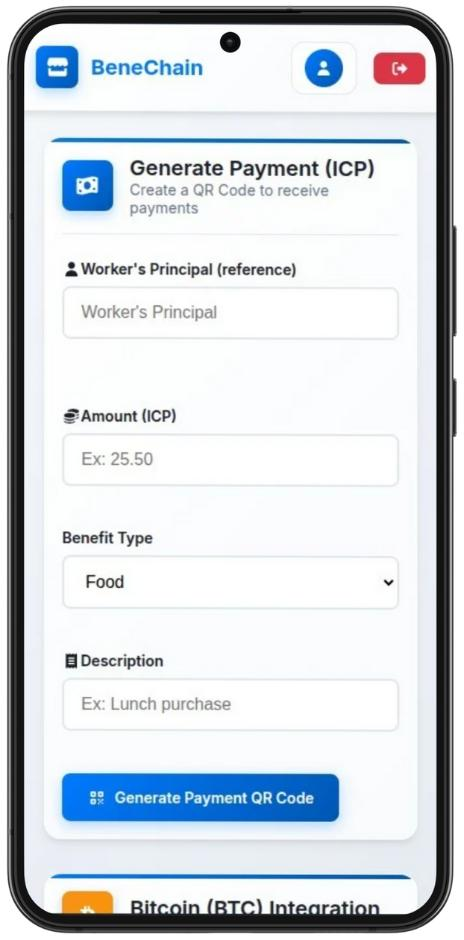


#### **Functional Overview**

This screen enables merchants (e.g., restaurants, stores, service providers) to create a benefit-linked payment request. The transaction is initiated on-chain and is tightly bound to the specific worker and benefit type being used.


#### **UI Elements and Fields**

| Field                   | Description                                                                                                      |
| -------------------- | ---------------------------------------------------------------------------------------------------------------- |
| **Worker’s Principal**  | The unique `Principal` of the worker making the payment. This ensures identity linkage and secure authorization. |
| **Amount (ICP)**        | The total amount to be charged, denominated in ICP tokens.                                                       |
| **Benefit Type**        | Specifies which benefit category (e.g., Food, Transport) the payment should be deducted from.                    |
| **Description**         | Optional note or label describing the purpose of the transaction (e.g., "Lunch purchase").                       |
| **Generate Payment QR** | Triggers a backend call to encode the transaction details and display a scannable QR code.                       |


#### **Technical Integration**

* Upon submission, the data is sent to the `establishment.mo` canister where the transaction is registered and validated.
* A secure QR code is generated representing the payment request, to be scanned by the worker's mobile device.
* All logic, from QR creation to balance deduction, is executed **fully on-chain**, with no reliance on third-party infrastructure.


#### **Strategic Role in the Platform**

This feature is critical for enabling **direct worker-to-merchant payments**, a core use case of BeneChain. It allows merchants to operate in the benefit ecosystem without needing to manage wallets, private keys, or traditional payment terminals.

The QR-based flow offers:

* Frictionless UX for unbanked or digitally inexperienced users.
* Strong compliance and traceability, as all transactions are tied to specific identities and benefit types.


---

### **Screen: Establishment Information**

**User Role:** Merchant

**Purpose:** To display the registration details and financial summary of the establishment.


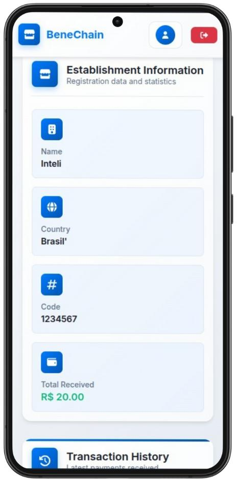

#### **Functional Overview**

This screen provides a merchant with a summary of their business information registered in the BeneChain system. It includes static details such as the business name and country, as well as dynamic financial indicators like the total amount of benefits received.


#### **UI Elements and Fields**

| Field              | Description                                                                                                                                                     |
| ------------------ | --------------------------------------------------------------------------------------------------------------------------------------------------------------- |
| **Name**           | The name of the registered establishment. Pulled from `establishment.mo`.                                                                                       |
| **Country**        | The country in which the merchant operates. Used for geolocation and potential regulatory filtering.                                                            |
| **Code**           | A unique business code assigned to the establishment. It may represent a CNPJ, local registry ID, or internal platform code.                                    |
| **Total Received** | The cumulative amount of ICP received from benefit payments, across all benefit types. Calculated on-chain via `getTransactionHistory()` in `establishment.mo`. |

#### **Technical Integration**

* All fields are sourced from the merchant’s profile stored in the `establishment.mo` canister.
* The `Total Received` value is computed by aggregating successful `processPayment()` calls tied to the merchant’s Principal.
* The information is protected by access control: only authenticated merchants can view their own data (enforced by `hasRole(principal, #Establishment)`).


#### **Strategic Role in the Platform**

This screen strengthens the **transparency and accountability** pillar of BeneChain by offering merchants a clear and verifiable summary of their participation.

Key advantages:

* Reinforces trust by making all financial data queryable and auditable.
* Provides an intuitive overview of benefit utilization at the point of sale.
* Lays the foundation for future analytics or integrations with ERP systems via the `reporting.rs` canister.

---

### **Screen: HR Dashboard – Manager & Fund Overview**

**User Role:** HR Manager

**Purpose:** To provide the HR manager with visibility over their identity, company linkage, and the available balance for distributing benefits to workers.

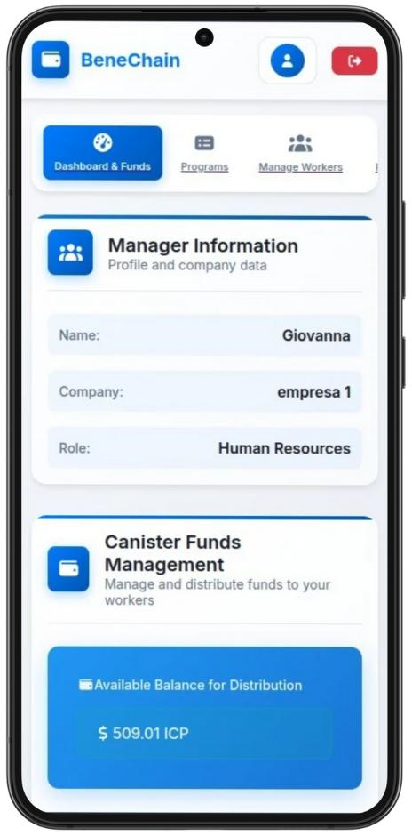

#### **Functional Overview**

This screen serves as the landing page for HR managers after authentication. It presents key information about their profile and shows the real-time on-chain balance available for benefit distributions. The interface ensures transparency and control over company-linked operations.


#### **UI Elements and Fields**

| Section                       | Field                              | Description                                                                                                                                             |
| ----------------------------- | ---------------------------------- | ------------------------------------------------------------------------------------------------------------------------------------------------------- |
| **Manager Information**       | Name                               | The name of the logged-in HR manager, fetched from `identity_auth.mo`.                                                                                  |
|                               | Company                            | The company this HR manager belongs to. This value is cross-validated by `belongsToCompany()`.                                                          |
|                               | Role                               | Fixed as “Human Resources” (authorization is required to access this view).                                                                             |
| **Canister Funds Management** | Available Balance for Distribution | The current ICP balance available to the company for funding worker benefit programs. Sourced from `wallets.mo` and linked to the HR/company principal. |


#### **Technical Integration**

* The manager profile is loaded from the `identity_auth.mo` canister using `getProfile()` and rendered client-side after login.
* The ICP balance is fetched from the `wallets.mo` canister using `getWallet()` or `getCompanyWallet()` (depending on implementation).
* Access to this screen is protected by role-based validation (must be `#HR`) and company matching.

#### **Strategic Role in the Platform**

This dashboard supports the platform’s goal of **decentralized, auditable fund management**. Key highlights include:

* HR can view exactly how much ICP is available to assign or schedule to workers.
* All funds remain **100% on-chain**, and no off-platform banking or fiat accounts are involved.
* The dashboard UI helps bridge the familiarity gap for corporate users who are new to Web3 environments, while still maintaining decentralization.

---

### **Screen: Transaction History – Merchant View**

**User Role:** Merchant

**Purpose:** To allow establishments to view all received payments from benefit transactions, categorized by origin, amount, type, and timestamp.

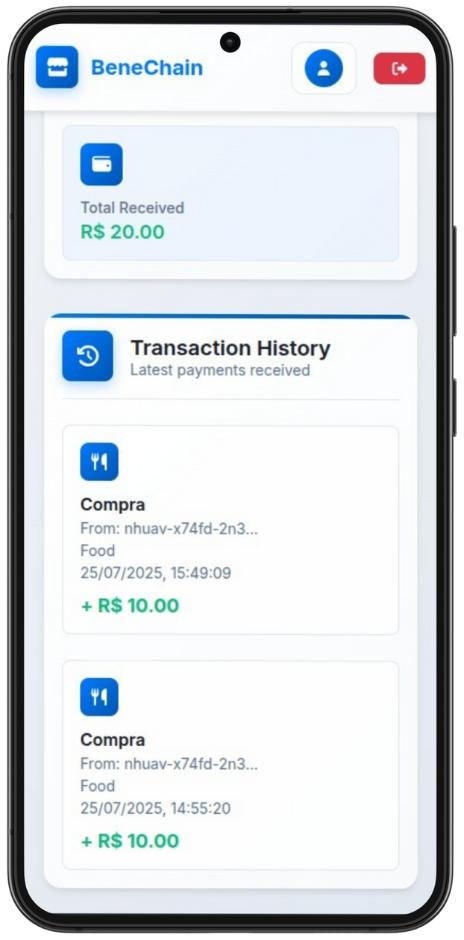

#### **Functional Overview**

This screen gives the merchant real-time access to their incoming transaction history. Each entry represents a benefit-based purchase initiated by a worker using BeneChain. This log helps establishments track performance and audit activity without relying on off-chain tools.


#### **UI Elements and Fields**

| Section                 | Field        | Description                                                                                                                                              |
| ----------------------- | ------------ | -------------------------------------------------------------------------------------------------------------------------------------------------------- |
| **Total Received**      | Amount       | The sum of all benefits (in ICP) received by the merchant. Aggregated from on-chain calls to `creditBalance()` and exposed by `getTransactionHistory()`. |
| **Transaction History** | Entry Type   | Indicates the nature of the transaction (e.g., “Compra” = Purchase).                                                                                     |
|                         | From         | Displays a shortened principal ID of the worker who made the payment.                                                                                    |
|                         | Benefit Type | Category used for benefit (e.g., Food, Health).                                                                                                          |
|                         | Timestamp    | Precise date and time the transaction occurred.                                                                                                          |
|                         | Amount       | Payment value received (positive ICP amount).                                                                                                            |

#### **Technical Integration**

* Data is fetched from `establishment.mo` using `getTransactionHistory()` filtered by the merchant’s Principal ID.
* All transactions are stored as immutable structs within the canister, ensuring full traceability.
* The display format includes data formatting and string shortening for better UX on mobile.

#### **Strategic Role in the Platform**

This screen supports **financial transparency and self-verification** for merchants:

* Enables reconciliation with internal systems or point-of-sale data.
* Promotes confidence in the platform by surfacing all on-chain payment activity in a clean UI.
* Supports future features like exporting history, syncing with ERPs, or issuing digital receipts.

---

### **Screen: Program Management – HR Dashboard**

**User Role:** Human Resources (HR Manager)

**Purpose:** To enable HR teams to visualize, manage, and create benefit programs that will be distributed to their employees via the BeneChain platform.

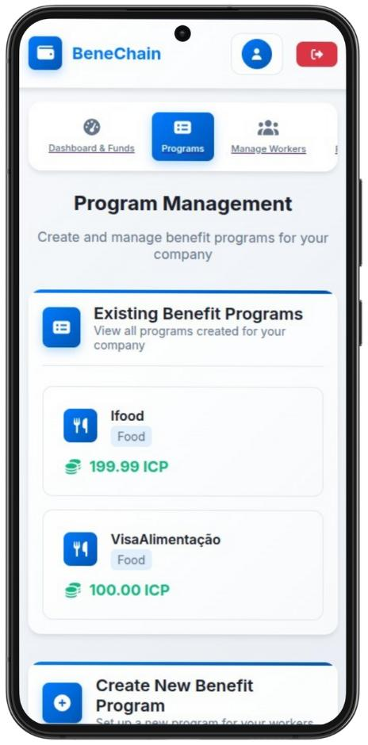

#### **Functional Overview**

This screen presents the HR user with a centralized interface for managing benefit allocations. It includes both a summary of existing benefit programs and a clear call-to-action to create new programs. All operations are fully on-chain, ensuring auditability and transparency.

#### **UI Elements and Fields**

| Section                        | Field                                       | Description                                                                                                                         |
| ------------------------------ | ------------------------------------------- | ----------------------------------------------------------------------------------------------------------------------------------- |
| **Tabs**                       | Dashboard & Funds, Programs, Manage Workers | Navigation menu for switching between operational modules.                                                                          |
| **Program Management**         | Title and Description                       | Introduces the functionality of the page to the HR user.                                                                            |
| **Existing Benefit Programs**  | Program Name (e.g., Ifood)                  | The name of each existing benefit program configured by the company.                                                                |
|                                | Benefit Type (e.g., Food)                   | Indicates the type/category of the benefit.                                                                                         |
|                                | Amount Allocated                            | Shows total value allocated to the benefit in ICP.                                                                                  |
| **Create New Benefit Program** | Button CTA                                  | Leads to the form to define new benefit programs, triggering an on-chain call to `createBenefitProgram()` in `benefits_manager.mo`. |


#### **Technical Integration**

* Programs are fetched from `benefits_manager.mo` using `getCompanyBenefitPrograms()` filtered by the logged-in Principal’s `companyId`.
* Each benefit object includes fields such as `type`, `amount`, and `frequency`, which are stored in stable memory.
* React components are dynamically rendered from canister actor interfaces exposed via `@dfinity/agent`.


#### **Strategic Role in the Platform**

This screen empowers the HR department to:

* Transparently manage their benefits offering.
* Adjust allocations based on internal HR policies or financial planning.
* Comply with auditing requirements by relying solely on on-chain definitions.

By consolidating all benefit data into a single interface, BeneChain simplifies HR operations while maximizing trust and verifiability.


---

### **Screen: Create New Benefit Program**

**User Role:** Human Resources (HR Manager)

**Purpose:** To allow HR representatives to configure and register new benefit programs for their company’s workers. These programs define the distribution rules and eligibility for on-chain employee allowances.

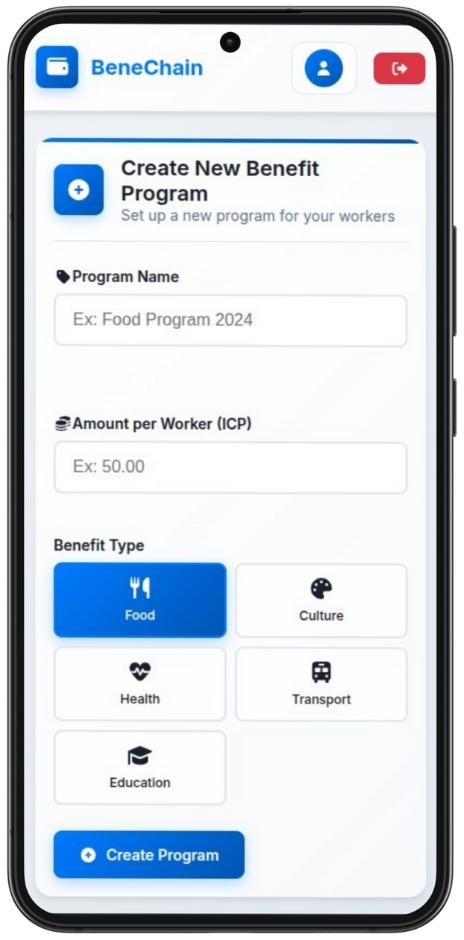

#### **Functional Overview**

This form-based interface guides HR managers through the process of registering a new benefit program. Once submitted, the program is persisted fully on-chain via the `benefits_manager.mo` canister and becomes eligible for assignment to employees.


#### **UI Elements and Fields**

| Field                       | Description                                                              |
| --------------------------- | ------------------------------------------------------------------------ |
| **Program Name**            | Free-text input to define a user-friendly label for the benefit program. |
| **Amount per Worker (ICP)** | Defines the fixed value that will be distributed to each worker in ICP.  |
| **Benefit Type**            | Selection field with predefined categories (Food, Culture, Health, etc.) |
| **Create Program Button**   | Triggers a call to `createBenefitProgram()` with the entered parameters. |


#### **Technical Integration**

* On submission, the frontend uses `@dfinity/agent` to send an authenticated call to the `benefits_manager.mo` canister.
* The underlying Motoko type for benefit programs is:

```motoko
type BenefitProgram = {
  id: Text;
  type: BenefitType;
  companyId: Text;
  amount: Nat;
  frequency: Frequency;
  day: Nat;
};
```

* Benefit metadata is stored in stable memory and retrievable via `getCompanyBenefitPrograms()`.


#### **Strategic Role in the Platform**

This screen is central to the system's programmability. It allows companies to:

* Tailor employee incentives to different verticals (e.g., food or transport).
* Ensure reproducible, automated distributions via smart contracts.
* Maintain financial control and transparency through immutable program definitions.

By placing benefit creation directly in the hands of HR managers, BeneChain empowers organizations with on-chain flexibility while eliminating the need for intermediaries or external integrations.

---

### **Screen: Worker Management**

**User Role:** Human Resources (HR Manager)

**Purpose:** To assign workers to benefit programs and manage individual allocation adjustments, enabling personalized and controlled distribution of funds.

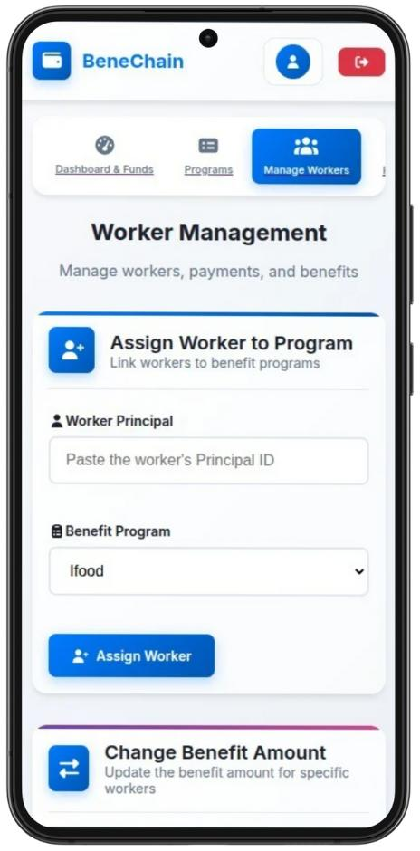

#### **Functional Overview**

This interface supports two key operations:

1. Assigning workers to predefined benefit programs.
2. Updating benefit values individually for specific workers (e.g., bonuses, adjustments).

These functions connect directly to the `benefits_manager.mo` canister for persistent and auditable on-chain configuration.


#### **UI Elements and Functionalities**

| Section                         | Description                                                              |
| ------------------------------- | ------------------------------------------------------------------------ |
| **Worker Principal**            | Input field for the user’s Internet Identity (Principal ID).             |
| **Benefit Program**             | Dropdown populated with existing programs registered by the company.     |
| **Assign Worker Button**        | Calls `assignWorkerToBenefit()` to persist association on-chain.         |
| **Change Benefit Amount (CTA)** | Opens a modal or route to allow individual adjustment of benefit values. |


#### **Technical Integration**

* The `assignWorkerToBenefit(principal, programId)` function is invoked via the frontend using `@dfinity/agent`.
* Validations are done using helper calls to `hasRole(principal, #Worker)` and `belongsToCompany(principal, companyId)` from the `identity_auth.mo` canister.
* On successful assignment, the mapping is stored in `benefits_manager.mo` to be referenced during automated or manual distributions.


#### **Strategic Role in the Platform**

This interface embodies BeneChain’s commitment to **multi-tenant, granular control** over benefit flows:

* Enables HR managers to build dynamic and modular distribution schemes.
* Allows for exception handling and personalized adjustments.
* Ensures transparent, role-bound benefit management across the organization.

This flexibility is critical in enterprise-grade benefit systems where workers may have varying entitlements or operational roles.

---

### **Screen: Worker Wallet & Transaction Statement**

**User Role:** Worker

**Purpose:** To allow individual workers to view their current benefit balances, track their spending, and access their transaction history in a transparent and user-friendly interface.

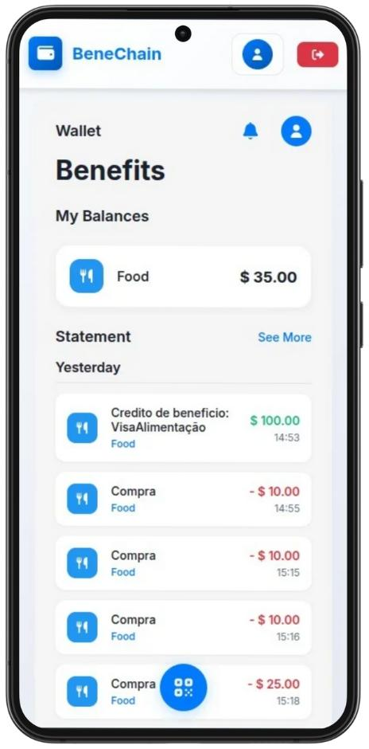

#### **Functional Overview**

This screen functions as the on-chain wallet interface for workers. It displays categorized balances and provides a detailed timeline of past transactions, including credits (from benefit programs) and debits (from purchases at registered merchants).

#### **UI Elements and Functionalities**

| Section                  | Field / Element               | Description                                                                                              |
| ------------------------ | ----------------------------- | -------------------------------------------------------------------------------------------------------- |
| **My Balances**          | Benefit Category (e.g., Food) | Shows the current balance for each benefit type in ICP. Pulled from `wallets.mo`.                        |
| **Statement**            | Transaction List              | Displays a chronological list of activity for the selected benefit type.                                 |
|                          | Credit Entry                  | Shows benefit top-ups (e.g., “VisaAlimentação”), with timestamp and value.                               |
|                          | Debit Entry                   | Shows purchases with value deduction and merchant name or tag (e.g., “Compra”).                          |
| **QR Button** (floating) | Action Button                 | Shortcut for generating a payment QR code or scanning to make a purchase (depending on the worker flow). |

#### **Technical Integration**

* Balances are fetched from `wallets.mo` via the `getWallet(principal)` method, using the logged-in Internet Identity.
* Each transaction is a record in a `[Transaction]` array stored in stable memory and queried using `getTransactionHistory()`.
* Data is filtered by `principal` and benefit `type`, ensuring strict isolation per user.
* All entries are immutable and cryptographically linked to on-chain activity.

#### **Strategic Role in the Platform**

This screen embodies BeneChain’s **end-user empowerment and transparency principles**:

* Workers can verify that they’ve received expected benefits.
* All spending is logged on-chain and visible without intermediaries.
* Promotes financial literacy and personal control over benefit usage.
* Builds trust through real-time, auditable information on mobile devices.

This mobile-first wallet is crucial for onboarding non-technical users and ensuring high usability across diverse worker profiles.

---

### **Screen: Canister Fund Management – Deposit Simulation**

**User Role:** Human Resources (HR Manager)

**Purpose:** To simulate the deposit of ICP funds into the company’s canister, which are later distributed to workers through scheduled or manual payments.

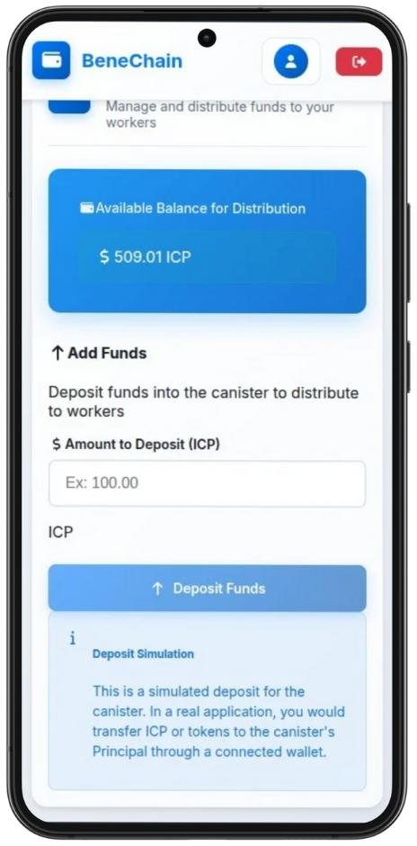


#### **Functional Overview**

This screen enables HR users to manage the available ICP balance held in their organization’s canister. Although no real tokens are transferred in this version, the system simulates deposits to test and demonstrate the funding flow. It supports validation of logic, UI feedback, and backend state transitions without relying on a live wallet.


#### **UI Elements and Functionalities**

| Section                       | Description                                                                     |
| ----------------------------- | ------------------------------------------------------------------------------- |
| **Available Balance**         | Displays the total ICP tokens currently simulated as deposited in the canister. |
| **Amount to Deposit (ICP)**   | Input field where the HR user defines how much ICP to simulate as deposited.    |
| **Deposit Funds Button**      | Triggers the simulated deposit by updating the backend’s canister balance.      |
| **Deposit Simulation Notice** | Informs the user that the deposit is only a simulation, not a live transaction. |

#### **Technical Integration**

* When the user submits the deposit form, a simulated backend method is called on the `benefits_manager.mo` or `wallets.mo` canister to increment the company’s available distribution balance.
* This design allows for testing of all downstream functionality (like crediting workers) without requiring a real wallet or transfer of ICP.
* The `Deposit Funds` button triggers internal state updates and renders the new available amount immediately.

#### **Strategic Role in the Platform**

This simulation is a **crucial usability and developer feature**:

* Allows HR teams to test workflows without needing live ICP tokens.
* Simplifies demos and hackathon testing without risking real funds.
* Supports future evolution to real wallet-based deposits via wallet integration or Chain Key Bitcoin/ICP bridge.

The simulation mode will later be swapped by live wallet deposits using a dedicated frontend bridge or through QR-based wallet scans.

### **Screen: QR Code Scanner – Payment Execution**

**User Role:** Worker

**Purpose:** Enables workers to scan a QR code presented by a merchant to initiate a payment using their on-chain benefits. This interface streamlines the purchase process using camera-based interaction.

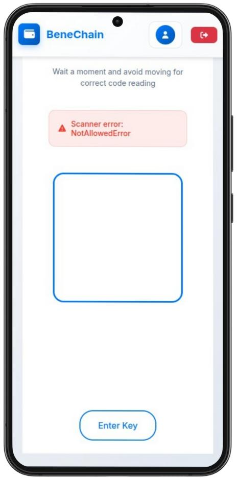

#### **Functional Overview**

This screen activates the device camera to scan QR codes generated by merchants. These codes contain payment instructions (worker principal, amount, benefit type), which are parsed and submitted as payment requests to the BeneChain backend.

If access to the camera is denied or unavailable, a fallback option allows workers to manually enter the payment key.


#### **UI Elements and Functionalities**

| Section              | Description                                                                           |
| -------------------- | ------------------------------------------------------------------------------------- |
| **Scanner Area**     | The central bounding box activates the device’s camera to detect a QR code.           |
| **Error Message**    | Displays the current scanner status (e.g., `NotAllowedError` for denied permissions). |
| **Instruction Text** | Reminds the user to stay still while scanning.                                        |
| **Enter Key Button** | Redirects to a fallback screen where the user can manually input the payment key.     |


#### **Technical Integration**

* The camera is accessed via Web APIs (e.g., `navigator.mediaDevices.getUserMedia()`), typically wrapped by a frontend QR scanner library.
* Upon successful scan, the decoded payload is sent to `establishment.mo -> processPayment()` and `wallets.mo -> debitBalance()` based on authorization checks.
* All scanner logic runs client-side, and the result is verified server-side before funds are deducted or approved.


#### **Strategic Role in the Platform**

This interface is essential to **real-world usability and trustless commerce**:

* Provides a seamless, low-friction payment experience for workers using benefit tokens.
* Eliminates the need for usernames or manual address entry.
* Bridges the worker–merchant interaction with immediate feedback and clear fallback mechanisms.
* Encourages real adoption by mimicking familiar behavior from consumer wallets and payment apps.

The fallback mechanism ensures accessibility even in low-connectivity or permission-restricted contexts, making the solution robust for a diverse user base.

---

### **Screen: User Profile & Identification Key**

**User Role:** All (Worker, HR, Merchant)

**Purpose:** Provides users with a concise summary of their identity within the BeneChain platform, including their principal (public key), current organization, and role-specific metadata.

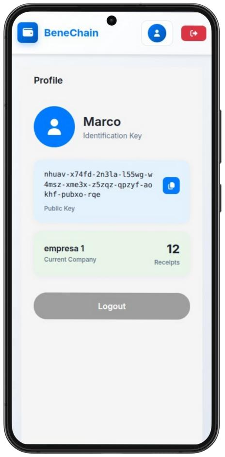

#### **Functional Overview**

This screen displays a user’s decentralized identity, allowing them to verify their **Internet Identity–issued principal**, understand which organization they are associated with, and access logout functionality. It supports both transparency and accountability by making user identifiers explicitly visible.


#### **UI Elements and Functionalities**

| Section                              | Description                                                                    |
| ------------------------------------ | ------------------------------------------------------------------------------ |
| **User Info**                        | Displays the user's name and Internet Identity–derived principal (public key). |
| **Identification Key**               | A base32-encoded `Principal` that uniquely identifies the user on-chain.       |
| **Current Company**                  | Shows the company to which the user is currently linked, based on their role.  |
| **Receipts (if Worker or Merchant)** | Shows a count of receipts or transaction logs tied to that user’s principal.   |
| **Logout Button**                    | Clears the session and returns the user to the login/authentication screen.    |


#### **Technical Integration**

* User identity is managed via **Internet Identity**, and the returned `Principal` is used to map the user to a profile in `identity_auth.mo`.
* Profile data is fetched via `getProfile(principal)`, which returns structured metadata: name, role, and companyId.
* The “Receipts” count is derived from `getTransactionHistory()` and filtered by user and role.

#### **Strategic Role in the Platform**

This screen reinforces the platform’s commitment to **self-sovereign identity** and **on-chain traceability**:

* Makes users aware of their persistent on-chain identity.
* Facilitates debugging and user support by exposing their own public key.
* Establishes a single source of truth for role-based access and company linking.
* Prepares users for features like **portable benefit profiles**, multi-company linkage, or tokenized reputation scores.

This profile screen is particularly helpful for HR managers auditing employee data, and for workers who may use their principal in external integrations (e.g., wallet import, QR scan confirmation).

---

### **Screen: Manual QR Payload Submission**

**User Role:** Worker

**Purpose:** Allows workers to manually input the QR code payload if camera scanning fails or is unavailable, ensuring payment processing is still possible.

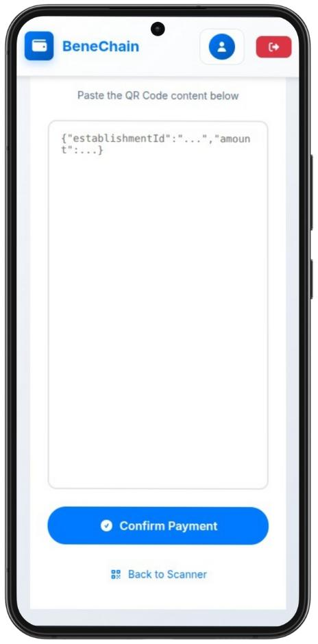

#### **Functional Overview**

This screen provides a manual fallback for QR code scanning, enabling users to paste raw JSON data (containing `establishmentId`, `amount`, and optionally benefit type and description) into a text box. Once the payload is validated, a payment request is submitted.


#### **UI Elements and Functionalities**

| Section                    | Description                                                                          |
| -------------------------- | ------------------------------------------------------------------------------------ |
| **Instruction Header**     | Guides the user to paste the QR code content, typically a JSON string.               |
| **Text Area**              | Input field for the raw payload (e.g., `{"establishmentId": "...", "amount": ...}`). |
| **Confirm Payment Button** | Triggers the parsing and submission of the payment to the backend.                   |
| **Back to Scanner**        | Navigates the user back to the camera-based scanner for QR capture.                  |


#### **Technical Integration**

* The pasted JSON is parsed client-side and validated before sending a payment request to `establishment.mo -> processPayment()` and `wallets.mo -> debitBalance()`.
* Common validation includes structure, existence of keys, numeric value of amount, and proper principal formatting.
* On success, a `confirmPayment()` mutation is triggered with authentication scoped to the currently logged-in worker.


#### **Strategic Role in the Platform**

This fallback screen strengthens the **resilience and inclusivity** of the BeneChain platform:

* Ensures accessibility for users in environments with limited camera access, restricted permissions, or broken hardware.
* Avoids dead-ends in the payment flow by supporting manual override without compromising security.
* Aligns with Web3's principle of **trustless openness** by allowing the user to transparently inspect the payment payload.

The manual confirmation option is a key differentiator for field deployment, especially for industrial workers or lower-end device contexts.

---

### **Screen: Manual Payment Submission (HR Role)**

**User Role:** HR Manager

**Purpose:** Enables HR managers to directly issue benefit payments to workers on an ad-hoc basis.

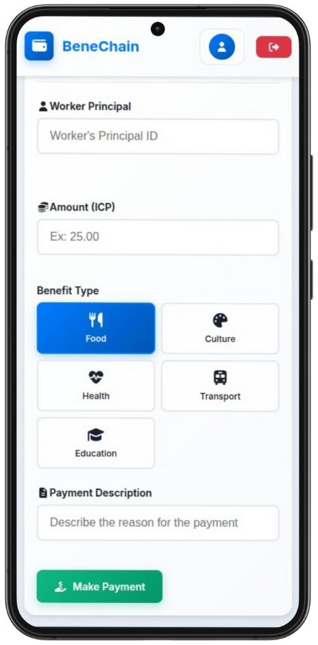

#### **Functional Overview**

This interface is designed for scenarios where HR needs to manually credit a worker’s wallet outside of scheduled programs—such as reimbursements, bonuses, or corrective actions. It allows full control over payment parameters, including benefit type and description.

#### **UI Elements and Functionalities**

| Element                 | Description                                                                         |
| ----------------------- | ----------------------------------------------------------------------------------- |
| **Worker Principal**    | Input for the recipient's unique Internet Identity principal.                       |
| **Amount (ICP)**        | Specifies how much to transfer in ICP (token denomination).                         |
| **Benefit Type**        | Lets the manager categorize the nature of the benefit (Food, Health, etc).          |
| **Payment Description** | Optional free-text field for internal tracking (e.g., "Meal compensation").         |
| **Make Payment Button** | Submits the payment, invoking backend canisters (`wallets.mo`, `identity_auth.mo`). |


#### **Technical Workflow**

1. **Authorization**: Ensures the current user has HR role (`identity_auth.hasRole(principal, #HR)`).
2. **Validation**:

   * Confirms that `principal` exists and belongs to the HR’s company.
   * Checks worker enrollment in the selected benefit program.
3. **Execution**:

   * Invokes `wallets.mo -> creditBalance()` with typed payload including amount, benefit type, and memo.
   * Logs the transaction in the internal ledger (persistent stable var).
4. **Error Handling**:

   * Captures insufficient balance, invalid principal, or permission mismatches.


#### **Strategic Relevance**

* **Flexibility**: Supports unscheduled distributions and corrective entries that don’t require full benefit program creation.
* **Transparency**: Logged transactions maintain auditability and allow reconciliation in `reporting.rs`.
* **Usability**: Keeps HR autonomous by reducing reliance on technical workflows for one-off disbursements.

---

## Future Roadmap

BeneChain was designed with extensibility in mind. Beyond its current fully on-chain MVP, several impactful improvements are planned to enhance interoperability and usability:


### **Stablecoin & Fiat Bridge**

Enable workers and merchants to redeem benefits in fiat or stablecoins through integrations with bridges and custodians — reducing friction for real-world usage.


### **Bitcoin Integration via Chain Key BTC**

Enable workers and merchants to receive **native Bitcoin payouts directly from ICP**, using the **Chain Key Bitcoin integration**.

* No bridges or wrapped tokens required
* On-chain calls to the Bitcoin network using ICP’s chain key cryptography
* Improves accessibility and real-world adoption for unbanked users

Example use cases:

* Worker opts to receive a portion of their benefits directly in BTC
* Merchant converts benefit tokens to BTC at settlement

### **DAO Governance**
Transition program management to a decentralized autonomous organization (DAO), allowing participating companies, employees, and community members to vote on:

* Funding rules
* Platform upgrades
* Whitelisted benefit types or vendors

---

## Resources

* [ICP Developer Docs](https://internetcomputer.org/docs/current/)
* [Motoko Base Library](https://internetcomputer.org/docs/current/motoko/main/)
* [AuthClient + AgentJS](https://github.com/dfinity/agent-js/)
* [PocketIC](https://github.com/dfinity/pocketic)

---

## Team

| Member | Linkedin                       |
| ------ | --------------------------- |
| Giovanna Britto | [Linkedin Giovanna](https://www.linkedin.com/in/giovanna-britto/)   |
| Lucas Britto | [Linkedin Lucas](https://www.linkedin.com/in/lucas-vieira-376665208/)     |
| Marco Peixoto | [Linkedin Marco](https://www.linkedin.com/in/marcoruas/) |

---

## ⚖️ License

MIT © 2025 — BeneChain Project Team
